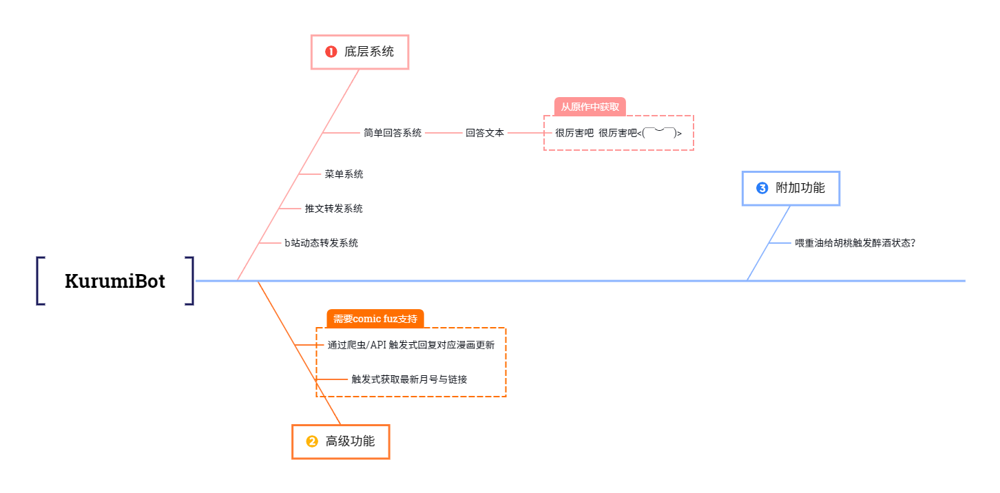

<div align=center></div>

<div align=center>

<p><strong>一款为芳文党服务的胡桃同学！</strong></p>

</img> </img> </img>

</div>

# 🤖AoBot

此项目基于 Nonebot2 和 go-cqhttp 开发，一款有一些插件的QQ群娱乐机器人

（此项目定位为个人Bot，可能不会进行长期维护！）

## 💭About

用爱发电，某些功能学习借鉴了大佬们的代码，并且引用了一些插件后进行个性化的修改，因为本人为胡桃同学力推人因此开发了Aobot，实现了一些对群友的娱乐功能/实用功能/芳文社相关功能（大概）。

## 🔨功能图



## 📣声明

此项目仅用于学习交流，请勿用于非法用途

此项目均为开源代码，在正常情况下除非引用代码的仓库另有许可证，所有代码均使用[**GPL v3**](https://choosealicense.com/licenses/gpl-3.0/)

## 💡简单部署

### 1.配置gocq

在 [go-cqhttp仓库](https://github.com/Mrs4s/go-cqhttp) 下载Releases最新版本，运行后选择反向WS/正向WS，然后打开go-cqhttp生成的 `config.yml`在对应地方填写 `0.0.0.0:6700`

例如选择正向WS，go-cqhttp生成的 `config.yml`中对应的地方填写应该这样

```yml
  # 正向WS设置
  - ws:
      # 正向WS服务器监听地址
      address: 0.0.0.0:6700
      middlewares:
        <<: *default # 引用默认中间件
```

### 2.配置AoBot

首先先获取本仓库文档，您可以下载[zip](https://github.com/misaka10843/AoBot/archive/refs/heads/main.zip)或者 `git clone https://github.com/misaka10843/AoBot.git`

如果您是下载的 `zip`，请解压后 `cd AoBot-main`

如果您是 `git clone`，请允许 `cd AoBot`

然后新建 `.env`文件，配置以下内容

```.env
# 此处无需更改
DRIVER=~httpx+~websockets
# 如果您的go-cqhttp不是在本机运行，请将127.0.0.1更改为对应的IP
ONEBOT_WS_URLS=["ws://127.0.0.1:6700"]

SUPERUSERS = ["机器人管理员qq"] #超级管理员

# bilibili URL解析插件设置
analysis_whitelist = [qq号,qq号] # 不解析里面填写的QQ号发的链接 List[int]
analysis_group_whitelist = [群号,群号] # 不解析里面填写的QQ群号发的链接 List[int]
```

### 3.启动对应端

首先，我们启动**go-cqhttp**

切换到go-cqhttp的文件夹，输入 `./go-cqhttp`，然后将进程挂起即可

(Linux可以使用 `Screen`来进行挂起)

然后，我们启动**AoBot**

**请注意，在进行接下来的过程前，请注意您的python必须大于等于3.8**

强烈建议您使用[虚拟环境](https://docs.python.org/zh-cn/3/library/venv.html)安装依赖和运行，不会创建虚拟环境可以去看 [virtualenv 文档](https://virtualenv.pypa.io/en/latest/index.html)，看不懂英语的可以去看[廖雪峰教程](https://www.liaoxuefeng.com/wiki/1016959663602400/1019273143120480)

首先，切换到AoBot文件夹，然后输入 `pip install -r ./requirements.txt`来安装依赖

然后输入 `python bot.py`来启动Bot后，挂起进程即可

## 🔗引用插件

- [bilibili视频、番剧解析](https://github.com/mengshouer/nonebot_plugin_analysis_bilibili)
- [HarukaBot(bili动态)](https://github.com/SK-415/HarukaBot)
- [HikariSearch](https://github.com/MeetWq/nonebot-plugin-hikarisearch)
- [无数据库的问答插件](https://github.com/kexue-z/nonebot-plugin-word-bank2)
- [nonebot-twitter(并未测试)](https://github.com/SlieFamily/nonebot-twitter)

其他未列出的插件因为并未做出修改，所以您可以直接在`plugins.json`中查看